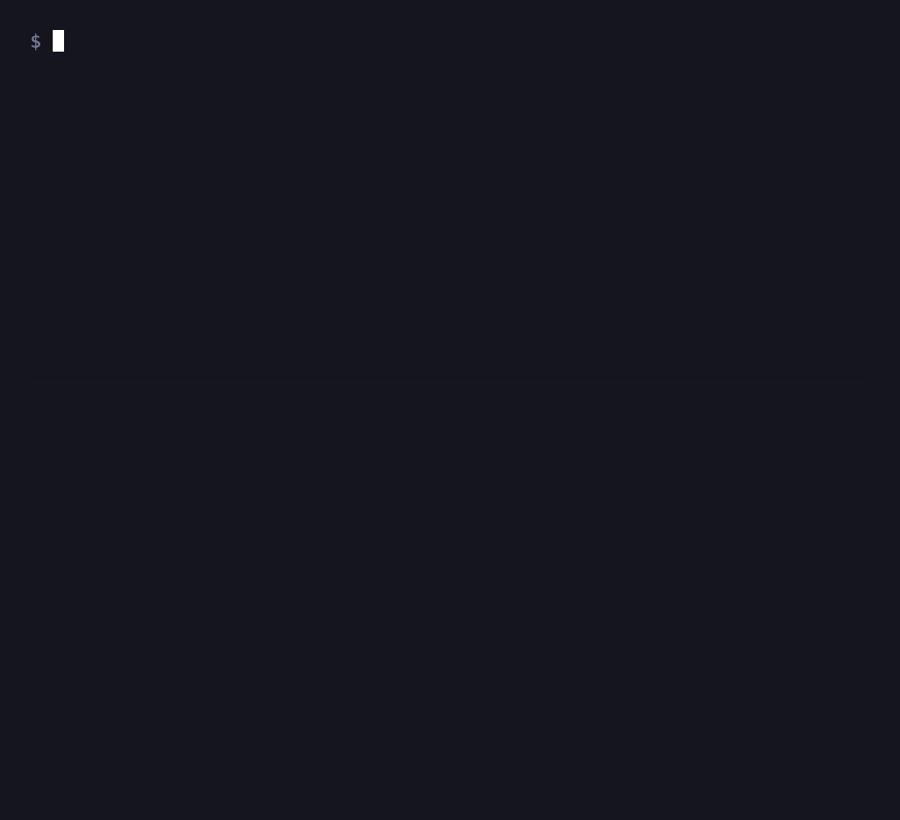

<div align="center">


[](https://github.com/ruidosujeira/chameleon/actions/workflows/ci.yml)

**A *semantic* reformatter for terminal output.**

It captures the machine-readable output of your tools and **re-renders it from
scratch** — with a single theme shared across all of them.



</div>

---

## The idea

Most terminal colorizers (`grc`, `colout`, `pipecolor`) do one thing: they take
the human-readable text a tool already printed and **recolor** it with regex.
Chameleon starts somewhere else.

> 🦎 **Chameleon doesn't recolor. It re-captures and redraws.**

For each tool, Chameleon calls its **machine surface** (`--porcelain`,
`--json`, …), parses the structured data, and **re-renders the entire output**
from the theme. The original human text is discarded — what you see is drawn by
Chameleon.

And every adapter drinks from the **same theme**. So `git`, `npm`, and `docker`
come out looking like **siblings** — something `bat`, `eza`, and `delta` don't
deliver, because each carries its own theme.

| | Recolors existing text | Single theme across tools |
|---|:---:|:---:|
| `grc` / `colout` | ✅ | ❌ |
| `bat` / `eza` / `delta` | — | ❌ (per-tool theme) |
| **🦎 Chameleon** | ❌ (re-renders) | ✅ |

---

## One theme, two tools

This is the whole pitch in one screen — two unrelated tools, captured from their
machine output and redrawn from the **same** theme. Same prompt glyph, same
glyph-and-color-per-state model, same aligned columns. They read as siblings:

<table>
<tr>
<th align="left"><code>chameleon git status</code></th>
<th align="left"><code>chameleon npm outdated</code></th>
</tr>
<tr valign="top">
<td>

```
❯ git status
  ⎇ main
  ✗ deleted    old.txt
  ✚ added      parser.go
  ● modified   app.go
  ? untracked  debug.tmp
```

</td>
<td>

```
❯ npm outdated
  ▲ major      chalk   4.0.0  → 4.1.2   (latest 5.6.2)
  ◆ minor      semver  7.3.0  → 7.8.1   (latest 7.8.1)
  ▪ patch      lodash  4.18.0 → 4.18.1  (latest 4.18.1)
```

</td>
</tr>
</table>

The GIF at the top is the whole pitch in motion — `git`, `npm`, `docker` and
`kubectl` rendered side by side from one theme, then **re-themed live** by
setting a single environment variable. It was recorded with
[VHS](https://github.com/charmbracelet/vhs) from
[`demo/showcase.tape`](demo/showcase.tape); `npm outdated` is colored by upgrade
severity (major / minor / patch) and the state lists float their failures to the
top, all straight from the shared theme.

---

## Installation

Requires **Go 1.22+**. No runtime dependencies beyond the TOML parser.

```sh
go install github.com/ruidosujeira/chameleon@latest
```

Or build from a clone:

```sh
git clone https://github.com/ruidosujeira/chameleon && cd chameleon
go build -o chameleon .
```

The default theme is **embedded in the binary**, so `chameleon` works from any
directory out of the box — no `themes/` folder required. To override it, drop a
`.chameleon.toml` in your project (or a theme under `~/.config/chameleon/themes/`);
see [Themes](#themes-) for the full resolution order.

---

## Usage

Prefix any supported command with `chameleon`:

```sh
chameleon git status
```

A command with no matching adapter? Chameleon runs it **raw**, without
interfering (a placeholder for the future `grc`-style regex fallback):

```sh
chameleon echo "passes straight through"   # → passes straight through
```

### Shell integration

Wrapping your tools is safe — any unsupported subcommand (e.g. `git log`) falls
straight through to the real tool. `init` prints the aliases:

```sh
eval "$(chameleon init zsh)"     # zsh / bash
chameleon init fish | source     # fish
```

Now `git status`, `npm outdated`, `docker ps`, … are themed automatically, and
everything else is untouched.

### Built-in subcommands

```sh
chameleon themes            # list the built-in themes
chameleon themes dracula    # preview a theme as a color swatch (+ validation)
chameleon doctor            # which tools are installed, theme, color support
chameleon version
```

### Environment variables

| Variable | Effect |
|---|---|
| `CHAMELEON_THEME` | Name of the theme to load (default: `tokyonight`). |
| `CHAMELEON_FORCE_COLOR=1` | Force color even without a TTY (useful in pipes/CI). |
| `CHAMELEON_DEBUG=1` | Print which theme won the resolution order (and from where) to stderr. |
| `NO_COLOR` | Disable all color ([no-color.org](https://no-color.org)). |

With none of these set, Chameleon enables color **only when `stdout` is a
terminal** — in a pipe it stays raw. No TTY library: just `os.Stdout.Stat()` +
`os.ModeCharDevice`.

---

## Themes 🎨

A theme is a versionable TOML file — your project's visual identity lives in it.
See [`themes/tokyonight.toml`](themes/tokyonight.toml):

```toml
name = "tokyonight"

[colors]
prompt = "#9ece6a"
branch = "#bb9af7"
ahead  = "#e0af68"
path   = "#7aa2f7"
# per-state colors (each entry is colored by its own state)
added   = "#9ece6a"
deleted = "#f7768e"
# …

[glyphs]
prompt = "❯"
branch = "⎇"
ahead  = "↑"
modified = "●"
# …

[layout]
indent = "  "
label_width = 10
```

Create a theme, swap the colors, and use it with
`CHAMELEON_THEME=dracula chameleon git status`. **Every** adapter follows along
— that's the whole point.

### Built-in themes

Six ship embedded in the binary — `chameleon themes` lists them, `chameleon
themes <name>` previews one as a color swatch:

`tokyonight` (default) · `dracula` · `catppuccin` · `gruvbox` · `nord` · `solarized`

### Text attributes

Beyond color, an optional `[styles]` table gives any key bold/dim/italic/underline:

```toml
[styles]
branch  = "bold"
path    = "dim"
command = "bold underline"
```

### Color depth

Themes are authored in 24-bit truecolor and **downsampled on the way out**:
Chameleon reads `COLORTERM`/`TERM` and degrades to the 256-color cube or the 16
ANSI colors when the terminal can't do better — so a theme looks right everywhere
without you maintaining per-depth palettes. `chameleon doctor` shows the detected depth.

### Where themes come from

Chameleon resolves the theme in this order — the **first** source that exists wins:

1. **`.chameleon.toml`** in the CWD or any parent up to the git root — your
   team's versionable theme; a full theme file that overrides everything.
2. **`~/.config/chameleon/themes/<name>.toml`** (respects `XDG_CONFIG_HOME`) —
   your personal theme.
3. **`./themes/<name>.toml`** relative to the CWD — dev convenience inside the repo.
4. **Embedded built-in** — compiled into the binary; the guaranteed fallback so
   it always works, from anywhere.

The theme name (steps 2–4) comes from `CHAMELEON_THEME`, defaulting to `tokyonight`.

---

## Architecture

Four pieces, deliberately small:

```
🦎 chameleon
├── style/      our OWN styling layer — zero Charm, zero framework
│               Color · Renderer (TTY/profile) · Width · PadRight · truecolor→256/16
├── theme/      loads themes/<name>.toml, resolves hex → Color, parses [styles]
├── adapters/   one renderer per tool, over two shared renderers:
│               outdated.go (severity ramp) · stateblock.go (worst-first states)
├── commands.go chameleon's own subcommands: themes · init · doctor · version
└── main.go     dispatcher: subcommands first, then the first adapter whose
                Handles() matches; otherwise run the command raw
```

The `style` layer is the **core competency**, which is why it depends on no
Charm packages (lipgloss/bubbletea). It's just three primitives:

```go
type Color struct{ R, G, B uint8 }
func (r *Renderer) Paint(c Color, text string) string   // 24-bit truecolor
func Width(s string) int                                 // width by rune
func PadRight(s string, width int) string                // alignment
```

> ⚠️ **Critical invariant:** always `PadRight` **before** `Paint`. Painting
> first injects escape codes that `Width` would then count as visible columns,
> breaking alignment.

### Adapters today

**git** — the non-diff surface:

| Command | Captures | States (glyph · color from theme) |
|---|---|---|
| `git status` | `git status --porcelain=v2 --branch` | added · deleted · modified · renamed · copied · typechange · untracked · **conflict** |

`chameleon git status --compact` collapses it to one prompt-sized line
(`⎇ main ↑2 ↓1  ✚3  ●1  ?2`) for a shell prompt or tmux.

**The package-manager family** — one shared severity ramp (major · minor · patch
· update), so they're indistinguishable apart from the command line:

| Command | Captures |
|---|---|
| `npm outdated` | `npm outdated --json` |
| `pip list --outdated` | `pip list --outdated --format json` |
| `cargo outdated` | `cargo outdated --format json` |
| `brew outdated` | `brew outdated --json=v2` |
| `go list -m -u` | `go list -m -u -json all` |
| `gem outdated` | `gem outdated` (line-parsed) |

**The state-list family** — one shared worst-first layout (failing states float to
the top), colored by an ok · warn · bad bucket:

| Command | Captures |
|---|---|
| `kubectl get pods` | `kubectl get pods -o json` (surfaces CrashLoopBackOff, …) |
| `docker ps` | `docker ps --format '{{json .}}'` |
| `gh run list` | `gh run list --json …` (CI conclusion / status) |
| `systemctl list-units` | `systemctl list-units --output=json` |

To add a tool, implement the contract and register it:

```go
type Adapter interface {
    Handles(argv []string) bool
    Render(argv []string, t *theme.Theme, r *style.Renderer) (string, error)
}
```

Want to teach Chameleon a new tool? [**CONTRIBUTING.md**](CONTRIBUTING.md) walks
through adding an adapter end to end, with the two existing adapters as worked
references.

---

## Re-recording the demo

VHS is a Charm dev tool used **only to record docs** — it is **not** a runtime
dependency; the Chameleon binary imports no Charm package.

```sh
go build -o chameleon .
vhs demo/showcase.tape      # → demo/showcase.gif  (the four-tool hero)
vhs demo/family.tape        # → demo/family.gif    (the focused two-tool cut)
```

The recording is **hermetic**: `git` runs for real, while `npm`, `docker` and
`kubectl` are stood in by the committed stubs in
[`demo/fixtures/`](demo/fixtures/) — so it needs no network, daemon or cluster.
Only the *upstream machine output* is fixed; everything Chameleon draws from it
is the real renderer.

---

## Roadmap

Out of scope for now, in rough order of interest:

- [x] Embedded built-in theme + `.chameleon.toml` / `~/.config` override layers
- [x] More adapters: package managers (`pip`/`cargo`/`brew`/`go`/`gem`) and state
      lists (`docker`/`kubectl`/`gh`/`systemctl`) — all on the single theme
- [x] Truecolor → 256/16 color downsampling
- [x] Six embedded themes + `chameleon themes` swatch preview + `[styles]` attributes
- [x] Shell integration (`chameleon init`) and `chameleon doctor`
- [ ] `grc`-style regex fallback for commands without an adapter
- [ ] CJK/emoji width via `go-runewidth` (swap point already marked in `style.Width`)

**Explicitly out of scope:** diffs — that's
[`delta`](https://github.com/dandavison/delta)'s territory. Chameleon targets
only the **non-diff** surfaces of tools.

---

<div align="center">
🦎 <em>One color to theme them all.</em>
</div>
